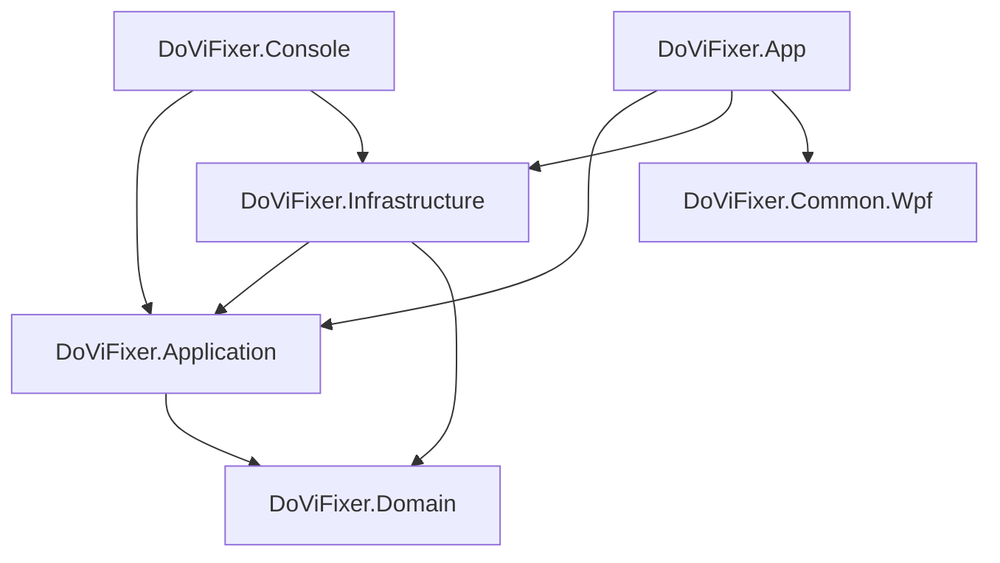

# DoViFixer solution architecture and implementation plan

Date: 2026-09-07

Updated: 2026-09-08 (automatic dependency detection and installation requirement).

Status: Console phases 1–3 implemented on 2026-09-08. The four production projects, focused test projects, dependency setup, read-only analysis, conversion/backup/restore/cleanup, settings and console composition now exist. WPF phase 4 is deferred as requested. See [upstream-parity.md](upstream-parity.md) for deliberate differences and the boundary between fixture-tested behavior and remaining environment-dependent integration checks. The design below remains the architecture reference.

## Objective

Port the workflows of cryptochrome/dovi_convert to a native Windows C# console application, then add a WPF application using MVVM and Prism. Both executable applications call the same shared services. The WPF application does not invoke or reference the console executable.

The baseline review covered the upstream Python source, changelog, roadmap, and all 14 pages listed in the documentation index. The local source examined identifies itself as version 8.2.0, at commit `7b682ebb4505b8c4a25a018881b640f74a4b383e`. Record that baseline in future parity work and recheck upstream before implementation.

The main architectural addition to the initial project list is `DoViFixer.Application`: a home for shared use cases and workflow coordination.

## Solution structure

Start with four production projects. Add WPF projects in the later presentation phase.

```text
DoViFixer/
|-- DoViFixer.sln
|-- AGENTS.md
|-- Directory.Build.props
|-- Directory.Packages.props
|-- global.json
|-- src/
|   |-- DoViFixer.Domain/
|   |   |-- Media/
|   |   |-- DolbyVision/
|   |   |-- Analysis/
|   |   `-- Conversion/
|   |-- DoViFixer.Application/
|   |   |-- Abstractions/
|   |   |-- Dependencies/
|   |   |-- Scanning/
|   |   |-- Inspection/
|   |   |-- Conversion/
|   |   |-- Backup/
|   |   |-- Restore/
|   |   |-- Cleanup/
|   |   |-- Operations/
|   |   |-- Settings/
|   |   |-- Updates/
|   |   `-- DependencyInjection.cs
|   |-- DoViFixer.Infrastructure/
|   |   |-- Dependencies/            # Detection, package installation, downloads
|   |   |-- MediaTools/
|   |   |   |-- Processes/
|   |   |   |-- DoviTool/
|   |   |   |-- MkvToolNix/
|   |   |   |-- FFmpeg/
|   |   |   `-- MediaInfo/
|   |   |-- FileSystem/
|   |   |-- TemporaryStorage/
|   |   |-- Archives/
|   |   |-- Configuration/
|   |   |-- Updates/
|   |   `-- DependencyInjection.cs
|   |-- DoViFixer.Console/
|   |   |-- Commands/
|   |   |-- Rendering/
|   |   |-- Interaction/
|   |   |-- Composition/
|   |   `-- Program.cs
|   |-- DoViFixer.App/                 # Later
|   |   |-- Views/
|   |   |-- ViewModels/
|   |   |-- Dialogs/
|   |   |-- Navigation/
|   |   |-- Composition/
|   |   |-- Resources/
|   |   `-- App.xaml
|   `-- DoViFixer.Common.Wpf/          # Optional, when useful reuse exists
|       |-- Controls/
|       |-- Behaviors/
|       `-- Converters/
|-- tests/
|   |-- DoViFixer.Domain.Tests/
|   |-- DoViFixer.Application.Tests/
|   |-- DoViFixer.Infrastructure.Tests/
|   `-- DoViFixer.Console.Tests/
`-- docs/
    |-- architecture.md
    `-- upstream-parity.md            # Create during implementation
```

Folders are organizational boundaries, not additional projects. Do not create empty service classes or interfaces merely to fill the tree.

## Project responsibilities and references

| Project | Responsibilities | Direct project references |
| --- | --- | --- |
| Domain | Immutable media models, Dolby Vision information, analysis findings, and pure eligibility/classification rules | None |
| Application | Scan, inspect, plan, convert, verify, backup, restore, cleanup, settings and update use cases; requests, results, progress; required external interfaces | Domain |
| Infrastructure | Native-tool adapters, parsing, files, temporary workspaces, archive serialization, settings persistence and HTTP | Application, Domain |
| Console | Entry point, DI composition, command parsing, prompts, rendering and exit-code mapping | Application, Infrastructure; Domain when directly using its models |
| App | WPF entry point and DI composition, views, ViewModels, dialogs and Prism navigation | Application, Infrastructure; Domain when directly using its models; Common.Wpf if extracted |
| Common.Wpf | Reusable WPF controls, behaviors and converters | No DoViFixer business projects |

Each test project references the code it exercises. Infrastructure and console tests can use inner-layer contracts and fixtures without introducing references from production code to tests.



The diagram shows the main reference direction. Executable references to Infrastructure support registration in the composition root. Commands and ViewModels use injected application services for their work.

## Dependency injection design

### Container choices

- **Console:** .NET Generic Host with the built-in `Microsoft.Extensions.DependencyInjection` container.
- **WPF:** Prism with DryIoc, using the supported Prism integration to import shared `IServiceCollection` registrations.
- **Shared code:** constructor injection and standard DI registration abstractions. No dependency on DryIoc, Prism, or a concrete container implementation in Application or Domain.

Sharing the workflows and registration methods does not require the two executables to use the same container implementation. This arrangement uses the normal .NET console hosting model and Prism's supported WPF container. Microsoft documents Generic Host's DI support; Prism documents DryIoc and `IServiceCollection` integration. [Generic Host](https://learn.microsoft.com/en-us/dotnet/core/extensions/generic-host), [Prism DI](https://docs.prismlibrary.com/docs/current/dependency-injection/).

### Shared registrations

Expose these registration methods:

- `AddDoViFixerApplication(IServiceCollection services)` in Application.
- `AddDoViFixerInfrastructure(IServiceCollection services, IConfiguration configuration)` in Infrastructure.

Application needs `Microsoft.Extensions.DependencyInjection.Abstractions` for its registration file. Infrastructure also needs configuration abstractions and the relevant implementation packages. Domain needs neither DI nor configuration packages.

The shared registration shape is:

```csharp
var builder = Host.CreateApplicationBuilder(args);
builder.Services.AddDoViFixerApplication();
builder.Services.AddDoViFixerInfrastructure(builder.Configuration);
// Register console commands and console-specific presentation services here.
```

In the console composition root, configure provider validation, build one host, resolve the command dispatcher, and manage host startup, shutdown and disposal. Parse command-specific options separately from host configuration and map application results to exit codes at the console boundary.

In WPF startup, prepare the same shared service registrations and import them into Prism's existing DryIoc container using the supported API for the chosen package versions. Register views, ViewModels, dialogs and navigation in the WPF project. Do not build a second Microsoft service provider or a separate Generic Host container beside Prism.

Choose and pin compatible package versions during scaffolding. Prove the WPF registration bridge with a small composition test when that phase starts; this plan does not prescribe unverified version-specific adapter calls. [Prism registration integration](https://docs.prismlibrary.com/docs/current/dependency-injection/servicecollection-supplement/).

### Lifetimes and ownership

| Component | Initial lifetime and ownership |
| --- | --- |
| Application workflow services | Transient; retain operation data in method-local state or explicit operation objects |
| CLI commands and WPF ViewModels | Transient; WPF navigation may retain a view according to its presentation policy |
| Immutable configuration defaults, stateless policies, thread-safe settings store and tool-path catalog | Singleton where appropriate |
| Native-tool adapters and process runner | Transient initially; singleton only if stateless and thread-safe |
| A running process, cancellation source, temporary workspace or stream | Created and disposed by its operation; never global singleton state |
| Future scoped persistence or operation dependencies | Explicit per-operation scope, created and disposed through a narrow factory/composition boundary |

WPF does not automatically create per-job scopes. A future singleton queue must create independent operations and must not capture scoped dependencies. Avoid service locator usage in business services and ViewModels; keep any container-backed factory implementation at the composition boundary. [Prism lifetimes](https://docs.prismlibrary.com/docs/current/dependency-injection/registering-types/).

DI registration and validation must not launch native tools, scan media, create working folders, or initiate conversions. Dependency checks are an application operation invoked automatically before media workflows or explicitly through the dependency commands. Help and argument validation remain lightweight. Installation requires approval of a concrete dependency installation plan.

## Shared application API

Model each use case with typed requests and results. Suggested focused services include ScanService, InspectionService, ConversionPlanner, ConversionService, BatchConversionService, BackupService, RestoreService and CleanupService. Final names can follow the implemented responsibilities.

Both interfaces use the same conversion path:

```text
Console ConvertCommand ----+
                          +--> ConversionPlanner / ConversionService
WPF ConversionViewModel ---+             |
                                        +--> Infrastructure adapters
```

- Use `CancellationToken` for long-running operations. Console Ctrl+C and the WPF Cancel command cancel the same operation contract.
- Report typed `OperationProgress` through `IProgress<OperationProgress>`. Include an operation identifier, stage, file and optional measurable progress. Support indeterminate progress when a tool provides no reliable percentage.
- Return structured results with status, output paths, warnings, verification findings and failure reasons. Only the console maps these to process exit codes.
- Separate planning from execution. A plan identifies exact inputs, requested target, proposed output paths, archive/retention choices and estimated storage requirements. Each UI presents the plan and submits explicit execution choices.
- Revalidate source identity, paths, available space and collisions before executing a prepared plan.
- Keep prompts, colors, tables, dialogs, observable collections and UI dispatching in presentation. Shared services must not call Console, MessageBox, Dispatcher or Prism navigation APIs.

Define interfaces at real external boundaries, such as `IMediaProbe`, `IVideoProcessor`, `IBackupArchiveStore`, `ITemporaryWorkspaceFactory` and `IOutputPublisher`. Keep native command construction and process-runner abstractions internal to Infrastructure when the application does not need them. Use `ILogger<T>` and `TimeProvider` where suitable instead of introducing redundant wrappers.

### Logging

Application and Infrastructure services use Microsoft `ILogger<T>` with structured message templates. `Application/Operations/OperationLog` defines history/audit event conventions and wraps operations with per-call scopes, monotonic elapsed timing, terminal status, and exception capture. It does not own a logger, access files, or create shared mutable operation state. Domain has no logging dependency.

The console's composition root configures Serilog through the existing Generic Host; the host owns and disposes the provider. It keeps the static Serilog logger untouched and does not build another service provider. The future WPF composition root should use the same event conventions and an owned Serilog provider in its Prism container. Presentation logs the plan actually shown and the approval method; application services log execution outcomes. Infrastructure logs native processes, retry/cleanup diagnostics, and settings changes after atomic publication while holding the settings writer lock.

Separate rolling JSON Lines sinks store operation history, audit, and diagnostics. Stable `LogKind` properties route history/audit independently of the diagnostic sink's minimum level. Session, command, batch, operation, plan, and native invocation IDs support correlation; failed batch items retain their exceptions while subsequent items continue. Logging neither authorizes execution nor changes verification rules. See the README for file locations, retention, configuration, and incident investigation.

## Upstream feature mapping

| Upstream capability | Application responsibility | Infrastructure responsibility |
| --- | --- | --- |
| scan, recursive discovery, candidate filtering | Coordinate discovery and classification; return media and analysis results | Enumerate files, probe streams, extract samples, parse metadata |
| inspect | Coordinate full RPU inspection and summarize evidence | Extract and parse complete RPU data |
| convert and batch conversion | Plan, validate eligibility, coordinate selected processing mode, verify and finalize | Execute native tools, manage pipes/workspaces and publish output |
| backup | Coordinate enhancement-layer archive creation and verification | Extract EL and serialize/read archive format |
| restore | Validate archive/input pairing, reconstruct and verify Profile 7 | Sanitize/extract base layer, combine layers and remux |
| cleanup | Identify exact candidates and require explicit execution choices | Revalidate and perform selected file operations |
| dependency checks and automatic installation | Check workflow requirements, prepare an installation plan, coordinate approved installation, and recheck readiness | Locate/version executables, resolve package sources, download/install selected tools and discover installed paths |
| update-check | Return release availability and diagnostic results | Retrieve release metadata |

Preserve upstream behavioral requirements in `docs/upstream-parity.md`: command options, recursive inputs, Profile 8.1 and HDR10 targets, safe extraction fallback, backup/restore, retention rules, cancellation and verification. Record deliberate deviations explicitly rather than treating every Python implementation detail as a requirement.

The C# application orchestrates native Windows executables. It does not initially reimplement HEVC or Dolby Vision bitstream processing in managed code. Keep FFmpeg/ffprobe, MKVToolNix, MediaInfo and dovi_tool behind focused adapters. Upstream documents the default streaming path and disk-extraction fallback. [Conversion guide](https://docs.doviconvert.com/essentials/conversion).

## Native dependency detection and automatic installation

Missing native dependencies must be detected and installable automatically from both the console application and the future WPF application. Installation is a shared application feature, not a manual prerequisite or duplicated UI implementation.

| Dependency | Executables to validate |
| --- | --- |
| FFmpeg | `ffmpeg.exe`, `ffprobe.exe` |
| MKVToolNix | `mkvmerge.exe`, `mkvextract.exe` |
| MediaInfo CLI | `mediainfo.exe` with working command-line output |
| dovi_tool | `dovi_tool.exe` |

### Detection and installation flow

1. Before a media operation, check its required executables automatically. Also provide a standalone check of the complete dependency set.
2. Resolve candidates from configured executable paths, application-managed tool locations, PATH and known installed locations. Validate candidates with bounded version/capability probes. File existence or a GUI-only installation does not establish readiness. If an explicitly configured path is invalid, report it and offer a replacement rather than silently selecting a different installation.
3. Report each dependency as ready, missing, incompatible or unusable, including its resolved path, version and diagnostic reason. Reuse compatible existing installations.
4. For missing tools, prepare an installation plan with the package/release identity, selected version, download source, destination or installation scope and any elevation requirement. Display the plan and offer automatic installation. Incompatible installations require an explicit repair/upgrade choice rather than being treated as missing.
5. Execute the approved plan, report progress and per-tool outcomes, then independently re-detect executable paths and validate versions/capabilities. Installer exit status alone does not prove readiness.
6. Persist validated selected tool paths in shared user settings and refresh the current process's tool catalog immediately. Use absolute executable paths so a newly installed tool works without restarting the app or relying on inherited PATH updates.
7. If requirements are satisfied, continue the original requested operation through its normal media planning/confirmation flow. Installation approval does not authorize conversion or deletion by itself. If declined or unsuccessful, stop the dependent operation with a clear result and recovery instructions; keep successful installations available for retry.

### Windows installation providers

Prefer WinGet when a suitable package is available, using an exact package ID and explicit source. Resolve and verify package IDs, versions, CLI contents and supported installation scopes during implementation; do not execute an ambiguous display-name search result. Prefer per-user installation where supported, and request elevation only for the chosen installer when necessary. Microsoft documents exact package selection and installation options in the [WinGet install reference](https://learn.microsoft.com/en-us/windows/package-manager/winget/install).

Support a direct-download provider for approved Windows release assets when a suitable package-manager route is unavailable, including [dovi_tool releases](https://github.com/quietvoid/dovi_tool/releases). Use a maintained source catalog, choose an asset matching the supported architecture, and validate downloads against trusted published checksums/signatures where available or a curated expected digest. Extract portable tools into versioned application-managed directories under `%LOCALAPPDATA%\DoViFixer\tools`. Do not fabricate integrity guarantees for assets lacking verification data; report that installation route as unavailable until a verified asset is configured.

WinGet itself must be detected. If neither a supported package-manager route nor a verified direct-download route is available, give specific manual setup instructions. Do not automatically install a package manager, compiler or Rust toolchain to satisfy a dependency. Recheck an approved installation plan if the source, version or installation scope changes before execution.

### Shared services and user interfaces

Place dependency workflows, requirements and typed status/install-plan/result models in `Application/Dependencies`. Introduce focused `IDependencyDetector` and `IDependencyInstaller` boundaries under `Application/Abstractions`; implementations and the installation source catalog belong in `Infrastructure/Dependencies`. Reuse the process execution, settings and progress facilities already planned. Register the services through `AddDoViFixerApplication` and `AddDoViFixerInfrastructure`; no extra production project or container is needed.

Proposed console commands are `dependencies check` and `dependencies install`. The install command presents the concrete plan and asks for confirmation; an explicit installation-specific `--yes` option supports unattended setup for the requested dependency set. The conversion command's confirmation options do not implicitly approve software installation. Interactive media workflows can offer installation automatically when their preflight check finds missing tools. Unattended media workflows return an actionable missing-dependency result unless installation has been explicitly authorized.

WPF presents the same status results and installation plan in a dependency setup view/dialog with an Install action. Approval applies to the selected installation plan once, including when preparing a batch. Both interfaces support progress and cancellation. If an external installer cannot cancel safely or requires a reboot, report that state explicitly; do not claim rollback or immediate readiness.

Acceptance checks cover complete/partial installations, invalid configured paths, GUI-only MediaInfo, incompatible versions, unavailable WinGet, declined installation, partial failures, cancellation, stale PATH and successful immediate use of newly installed tools. Fast tests use fake detectors/installers and do not install software; actual installer integration checks run only in an explicitly approved environment.

## Media-specific design requirements

### Analysis evidence

Separate detected media properties, analysis findings and conversion decisions. Keep `Unknown` or `AnalysisFailed` distinct from detected complex FEL. Include sampling/full-RPU method, metadata availability and assumptions in results. A missing MaxCLL value must not silently become a confirmed measurement.

Upstream scans samples and inspects full RPU metadata. Its current inspection implementation compares metadata-derived values, including a fallback when MaxCLL is unavailable. Full base-layer frame analysis is listed separately in its roadmap. Preserve that distinction instead of describing metadata heuristics as guaranteed playback correctness. [Scanning guide](https://docs.doviconvert.com/essentials/scanning), [upstream source](https://github.com/cryptochrome/dovi_convert/blob/main/dovi_convert.py), [roadmap](https://github.com/cryptochrome/dovi_convert/blob/main/ROADMAP.md).

### Backups and compatibility

Original-file retention and enhancement-layer archives are separate concepts. Upstream uses `.bak.dovi_convert` for the complete original and `.dovi` for an uncompressed TAR containing `el.hevc`. Its repository and backup pages implement backup/restore despite the introduction's stale "coming soon" label. [Backup guide](https://docs.doviconvert.com/essentials/backup-restore).

Keep archive serialization behind its own interface. Document compatibility with upstream archives explicitly. If adding manifests, hashes or versioned metadata, distinguish the extended format from the upstream baseline and test interoperability. A legacy archive without pairing evidence must not be reported as having verified source identity. Validate restored media content rather than promising byte-identical MKV containers.

### Processes, temporary storage and publication

- Use argument lists, asynchronous process waiting, concurrent output/error draining and cancellation that terminates owned child processes. Avoid shell-composed native commands.
- Use operation-owned temporary workspaces and calculate storage requirements from the selected workflow and its fallback path.
- Write final media to a temporary output on the destination volume, verify it, then publish it with collision checks. Keep incomplete output distinguishable from completed media.
- Centralize original-retention and output-publication behavior so console and WPF perform the same file operations.
- Verify target profile, video/frame information, timing and expected retained tracks/metadata. Treat unavailable verification as an explicit result, not success.
- Keep deletion and cleanup tied to exact planned files and explicit user choices. Conversion planning does not authorize deletion by itself.

## Runtime and configuration

Use .NET 10 LTS. The machine had SDK `10.0.400` installed when reviewed; pin the chosen compatible SDK in `global.json` during scaffolding. [Microsoft support policy](https://dotnet.microsoft.com/en-us/platform/support/policy/dotnet-core).

- Domain and Application: `net10.0`.
- Infrastructure and Console: `net10.0-windows` for the Windows implementation.
- App and Common.Wpf: `net10.0-windows`, with WPF enabled.
- Tests: target the framework required by the projects under test.

Use `Directory.Build.props` for shared compiler settings and `Directory.Packages.props` for central package versions. Keep Prism and its container package references in App; Console uses Microsoft hosting and DI packages.

Both applications use the same persisted user settings location, proposed as `%LOCALAPPDATA%\DoViFixer\settings.json`. Infrastructure handles serialization and atomic settings writes. An operation receives a validated settings snapshot; command-line overrides apply to that operation unless an explicit settings action persists them. Serialize or detect conflicting writes if both applications update settings concurrently.

Keep service instances shared within one process only. Running the console and WPF application concurrently does not share a DI container or in-memory operation state. Cross-process coordination, if introduced later, needs a separate explicit design.

## Implementation sequence

1. **Solution foundation:** create the four initial production projects and focused test projects; configure targets and package versions; implement DI registrations and console composition. Validate references, service resolution, lifetimes and disposal with inert test doubles.
2. **Dependency setup and read-only media workflows:** dependency detection, approved automatic installation, post-install validation and current-process path refresh; then media probing, scan and inspect, pure classification rules, typed results, cancellation and console output. Test detection/installation coordination with fakes and validate media analysis against representative tool-output fixtures.
3. **Media workflows:** conversion planning/execution, verification, publication, backup, restore and cleanup. Add batch coordination and settings persistence. Compare supported commands with the upstream parity checklist and run integration checks using explicitly selected media fixtures.
4. **WPF presentation:** add Prism/DryIoc composition and verify the shared registration bridge. Build dependency setup, scan, inspection, conversion, backup/restore and settings views over existing services. Test cancellation/progress and add focused ViewModel/composition tests. Extract Common.Wpf only when reusable components emerge.

For native-media integration checks, cover supported profile/EL cases, spaces and punctuation in paths, output collisions, cancellation, missing tools, malformed output, verification failures and archive mismatches. Keep these separate from fast unit tests.

Separate Prism module assemblies, a database, watch-folder processing, a background service, remote UI and a general plugin framework are deferred until required. A DI container does not require additional production projects or an interface for every class.

## Documentation reviewed

The complete upstream documentation inventory contains these 14 pages:

1. [Introduction](https://docs.doviconvert.com/)
2. [Before You Start](https://docs.doviconvert.com/before-you-start)
3. [Terminal / Shell](https://docs.doviconvert.com/installation/terminal)
4. [Docker](https://docs.doviconvert.com/installation/docker)
5. [File Scanning & Analysis](https://docs.doviconvert.com/essentials/scanning)
6. [File Conversion](https://docs.doviconvert.com/essentials/conversion)
7. [Backup & Restore](https://docs.doviconvert.com/essentials/backup-restore)
8. [scan](https://docs.doviconvert.com/command-reference/scan)
9. [inspect](https://docs.doviconvert.com/command-reference/inspect)
10. [convert](https://docs.doviconvert.com/command-reference/convert)
11. [backup](https://docs.doviconvert.com/command-reference/backup)
12. [restore](https://docs.doviconvert.com/command-reference/restore)
13. [cleanup](https://docs.doviconvert.com/command-reference/cleanup)
14. [update-check](https://docs.doviconvert.com/command-reference/update-check)

The source review also used the [repository](https://github.com/cryptochrome/dovi_convert), [changelog](https://github.com/cryptochrome/dovi_convert/blob/main/CHANGELOG.md), and [roadmap](https://github.com/cryptochrome/dovi_convert/blob/main/ROADMAP.md).

### Console conversion progress

Conversion reports through IProgress<OperationProgress>. Extraction and remuxing read MKVToolNix GUI progress records as stdout arrives; 100 percent is reported only after a successful process exit. Verification percentages count completed checks rather than elapsed time. Metadata conversion stays indeterminate while dovi_tool runs and reports completion after success. Interactive stderr updates each stage in place, truncating long paths to the terminal width; redirected stderr prints only stage starts and completions. The singleton console renderer serializes shared terminal state and ends pending lines before results or disposal.
